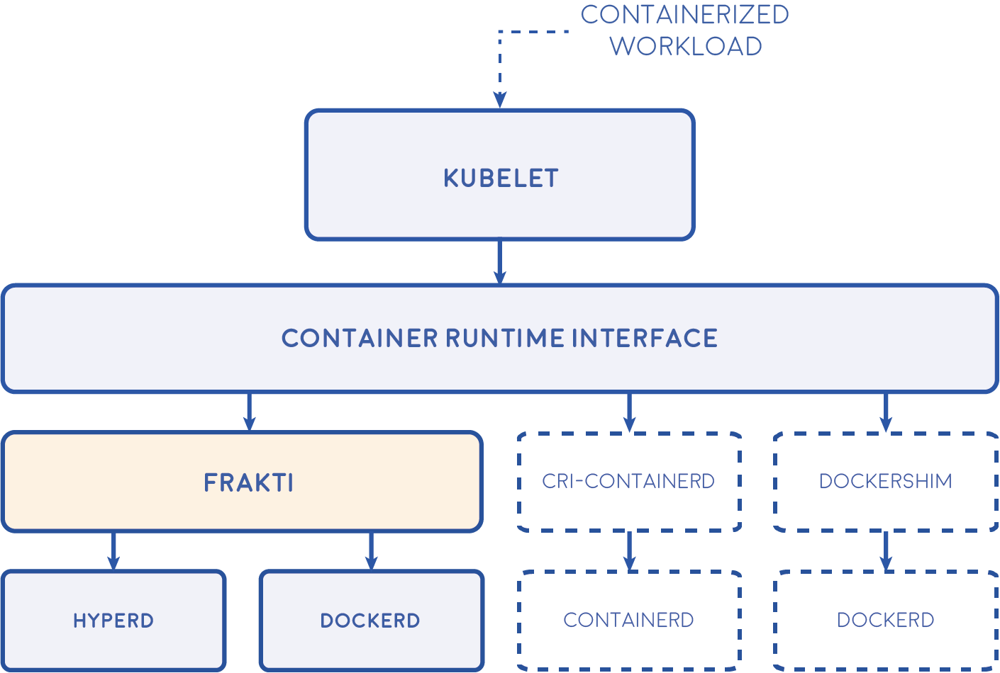

# Frakti

[](https://travis-ci.org/kubernetes/frakti) [](https://goreportcard.com/report/github.com/kubernetes/frakti)

## The hypervisor-based container runtime for Kubernetes

Frakti lets Kubernetes run pods and containers directly inside hypervisors via [runV](https://github.com/hyperhq/runv). It is light weighted and portable, but can provide much stronger isolation with independent kernel than linux-namespace-based container runtimes.

<p align="center">
  
</p>

Frakti serves as a CRI container runtime server. Its endpoint should be configured while starting kubelet. In the deployment, [hyperd](https://github.com/hyperhq/hyperd) is also required as the API wrapper of runV.

## QuickStart

Build frakti:

```sh
mkdir -p $GOPATH/src/k8s.io
git clone https://github.com/kubernetes/frakti.git $GOPATH/src/k8s.io/frakti
cd $GOPATH/src/k8s.io/frakti
make && make install
```

Install docker and hyperd:

```sh
apt-get install qemu libvirt0 docker.io -y
curl -sSL https://hypercontainer.io/install | bash
```

Configure hyperd with gRPC endpoint `127.0.0.1:22318`:

```sh
cat >/etc/hyper/config <<EOF
# Boot kernel
Kernel=/var/lib/hyper/kernel
# Boot initrd
Initrd=/var/lib/hyper/hyper-initrd.img
# Storage driver for hyperd, valid value includes devicemapper, overlay, and aufs
StorageDriver=overlay
# Hypervisor to run containers and pods, valid values are: libvirt, qemu, kvm, xen
Hypervisor=qemu
# The tcp endpoint of gRPC API
gRPCHost=127.0.0.1:22318
EOF

systemctl restart hyperd
```

Setup CNI networking using bridge plugin

```sh
$ sudo mkdir -p /etc/cni/net.d  /opt/cni/bin
$ git clone https://github.com/containernetworking/plugins $GOPATH/src/github.com/containernetworking/plugins
$ cd $GOPATH/src/github.com/containernetworking/plugins
$ ./build.sh
$ sudo cp bin/* /opt/cni/bin/
$ sudo sh -c 'cat >/etc/cni/net.d/10-mynet.conflist <<-EOF
{
    "cniVersion": "0.3.1",
    "name": "mynet",
    "plugins": [
        {
            "type": "bridge",
            "bridge": "cni0",
            "isGateway": true,
            "ipMasq": true,
            "ipam": {
                "type": "host-local",
                "subnet": "10.30.0.0/16",
                "routes": [
                    { "dst": "0.0.0.0/0"   }
                ]
            }
        },
        {
            "type": "portmap",
            "capabilities": {"portMappings": true},
            "snat": true
        }
    ]
}
EOF'
$ sudo sh -c 'cat >/etc/cni/net.d/99-loopback.conf <<-EOF
{
    "cniVersion": "0.3.1",
    "type": "loopback"
}
EOF'
```

Then start frakti:

```sh
frakti --v=3 --logtostderr --listen=/var/run/frakti.sock --hyper-endpoint=127.0.0.1:22318 &
```

Finally, start kubernetes with frakti runtime:

```sh
cd $GOPATH/src/k8s.io/kubernetes
hack/install-etcd.sh
export PATH=$GOPATH/src/k8s.io/kubernetes/third_party/etcd:${PATH}
export KUBERNETES_PROVIDER=local
export CONTAINER_RUNTIME=remote
export CONTAINER_RUNTIME_ENDPOINT=/var/run/frakti.sock
hack/local-up-cluster.sh
```

To start using the cluster, open up another terminal and run:

```sh
cd $GOPATH/src/k8s.io/kubernetes
export KUBECONFIG=/var/run/kubernetes/admin.kubeconfig
cluster/kubectl.sh
```

## Documentation

Further information could be found at:

- [Deploying](docs/deploy.md)
- [End-to-end testing](docs/e2e-tests.md)
- [Kubelet container runtime API](https://github.com/kubernetes/community/blob/master/contributors/design-proposals/node/runtime-client-server.md)
- [runV](https://github.com/hyperhq/runv)
- [hyperd](https://github.com/hyperhq/hyperd)
- [The blog on k8s.io about Hypernetes](http://blog.kubernetes.io/2016/05/hypernetes-security-and-multi-tenancy-in-kubernetes.html)

## The differences between `frakti` with other Linux container runtimes

- Better Security and Isolation
  - frakti provides hardware virtualization based Pod sandbox for Kubernetes.
- No Kernel Sharing
  - Every Pod in frakti has its own kernel (Bring Your Own Kernel), LinuxKit image support is on the way
- Match k8s QoS Classes.
  - frakti is best to run Pod with `resources.limits` being set (i.e. all Guaranteed and most Burstable Pods), otherwise, frakti will set default resource limit for Pod.
  - This behavior is configurable by `--defaultCPUNum` and `--defaultMemoryMB`  of frakti
- Mixed Runtimes Mode.
  - frakti support mixed runtimes on the same Node (runV and Docker). We recommend user to run `BestEffort` Pods, daemon Pods in Docker runtime by adding `runtime.frakti.alpha.kubernetes.io/OSContainer` annotation to them.
  - Additionally, special cases like privileged Pods, host network Pods etc will be automatically run in Docker runtime.
- Persistent Volume
  - All k8s PVs are supported in frakti.
  - **Block device as volume directly**: in this way, frakti will mount block device directly to VM based Pod, which gives you better performance than first approach. For now Cinder RBD is the mainly supported volume provider, please check [Stackube](https://github.com/openstack/stackube) for the whole deployment (k8s + frakti + Cinder + Keystone + Neutron).
- Cross-host Networking
  - frakti is fully based on CNI (bridge mode only for now), so there's no big difference here.
  - Network plug-ins like `Flannel` & `Calico` can work out-of-box with `frakti` based Kubernetes.

Besides the lists above, all behaviors of frakti are 100% the same with other Liunx container runtimes like Docker, please enjoy it!

## License

The work done has been licensed under Apache License 2.0.The license file can be found [here](LICENSE). You can find out more about license at [http://www.apache.org/licenses/LICENSE-2.0](http://www.apache.org/licenses/LICENSE-2.0).
